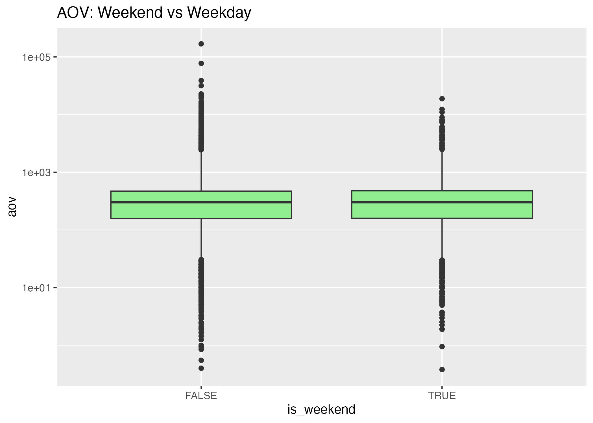

```{r setup, include=FALSE}
knitr::opts_chunk$set(echo = TRUE, warning = FALSE, message = FALSE, fig.width=7, fig.height=5)
library(knitr)
library(ggplot2)
library(readr)
library(dplyr)
```

## R Markdown

## 1. Business Problem
We are examining e-commerce customer behavior to better understand purchasing patterns and support business growth.
Our main goals are:
- Increase revenue by identifying high-value customers
- Reduce order cancellations
- Understand buying patterns across weekdays and weekends
- Provide actionable recommendations to improve customer engagement

---

## 2. Load scripts
```{r load-scripts}
# Source all R scripts
source("code/01_packages.R")
source("code/02_load_clean_data.R")
source("code/03_eda.R")
source("code/04_hypothesis_tests.R")
source("code/05_modeling.R")
source("code/06_rfm_analysis.R")
```
## 3. Exploratory Data Summary
Below is a summary of the dataset and key insights from the EDA:
# Show skim summary from EDA script
```{r eda-summary}
skim(data)
```
Average Order Value (AOV) Distribution:
```{r}

```
Weekend vs Weekday AOV:
```{r}

```
Top 10 Countries by Cancellations:
```{r}

```
- Most invoices have lower AOV, with a few high-value purchases creating a right-skewed distribution.
- Weekend vs weekday analysis shows differences in spending patterns.

## 4. Hypothesis Test Results
# Display t-test results
Weekend vs Weekday AOV (t-test)
```{r}
ttest_weekend
```
Top 20% Monetary Customers Frequency (t-test)
```{r}
ttest_top20
```
Chi-square Test: Cancellations by Top 10 Countries
```{r}
chi_country
```
Chi-square Test: Weekend vs Weekday Cancellations
```{r}
chi_weekend_test
```
Interpretation: Weekend purchases appear to differ from weekday purchases. This can inform marketing campaigns targeting higher spending periods.

## 5. Predictive Modeling Results
# Show confusion matrix and AUC from modeling script
Confusion Matrix and AUC
```{r}
cm
auc_val
```
ROC Curve
```{r}
plot(roc_obj, col="blue", main=paste("ROC Curve (AUC =", round(auc_val,3), ")"))
```
Interpretation: The logistic regression model moderately predicts high-value invoices. The ROC curve and AUC provide a performance measure, which can guide operational decisions.

## 6. RFM Analysis Results
# Display top 10 RFM customers
Top 20 Customers by Monetary Value
```{r}
top_customers
```
Top 10 Customers Visualization
```{r}
top_plot <- top_customers[1:10, ]
ggplot(top_plot, aes(x=reorder(customer_id, monetary), y=monetary)) +
  geom_col(fill="steelblue") +
  coord_flip() +
  labs(title="Top 10 Customers by Monetary Value", x="Customer ID", y="Monetary Value")
```
Interpretation: These customers are the most valuable and should be prioritized for retention campaigns and targeted promotions.

## 7. Discussion
- The EDA revealed that most purchases are small, but a minority of high-value invoices drive - significant revenue.
Weekend spending differs from weekdays, suggesting opportunities for targeted weekend promotions.
- Logistic regression provides useful predictions for high-value invoices, though further features could improve performance.
- RFM segmentation identifies customers with high purchase frequency, recency, and monetary value, guiding marketing and retention strategies.

## 8. Recommendations
- Focus campaigns on top RFM customers for better ROI.
- Introduce weekend promotions to leverage higher average spending.
- Use the predictive model to flag potential high-value orders in advance.
- Collect more granular data (product categories, channels) for richer modeling and insights in the future.

## 9. References
- Customer segmentation with RFM analysis
- Logistic regression and ROC/AUC for classification
- Tidyverse for reproducible data cleaning and visualization


